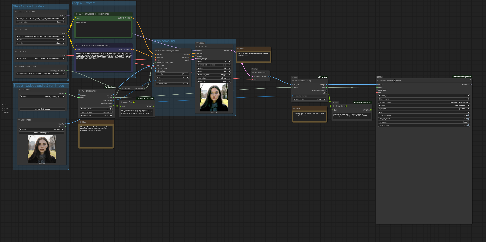

# ComfyUI-AV-Handles


https://github.com/user-attachments/assets/79817bcc-6f69-490e-99e9-a84ed106c597

> **Result:** Handle frames added → AnimateDiff processing → Handles trimmed = Perfect sync, stable output from frame 1 ✓

<details>
<summary>🔧 <b>View Workflow Example</b></summary>
<br/>
<p align="center">
  
</p>
</details>

---

## What does it do?

Audio/Video handle management for ComfyUI workflows

Add and remove stabilization frames with synchronized audio for video diffusion models.

Video diffusion models (AnimateDiff, etc.) often need a few frames to stabilize before producing quality output. This node pack lets you:

- Add repeated first frames as "handles" before your sequence
- Sync audio silence to keep A/V perfectly aligned  
- Trim handles after processing to restore original length
- Round frame counts to WAN-compatible values (4n+1 pattern)
- Process audio-only with precise timing control via manual FPS

**Typical workflow:**
```
24 frames → Add 8 handles (32 frames) → Process → Trim 8 handles → 24 frames
```

**Audio-only workflow:**
```
Audio (2.0s) + FPS:30 → Add handles → Process → Trim handles → Audio restored
```

## Installation

### Via ComfyUI Manager (Recommended)

Search for "AV Handles" and install directly.

### Manual Installation

```bash
cd ComfyUI/custom_nodes
git clone https://github.com/pizurny/ComfyUI-AV-Handles.git
# Restart ComfyUI
```

### Alternative: Direct Download

- Download this repository as ZIP
- Extract to `ComfyUI/custom_nodes/ComfyUI-AV-Handles/`
- Ensure folder structure:
```
ComfyUI-AV-Handles/
├── nodes/
│   ├── av_handles_add.py
│   └── av_handles_trim.py
├── utils/
│   └── wan_utils.py
└── __init__.py
```
- Restart ComfyUI

## Usage

Nodes will appear under: **video/handles**

### AV Handles Add

Adds handle frames by repeating the first frame + audio silence.

**Required Inputs:**
- `handle_frames` (INT) - Frames to add (default: 8, range: 0-100). Set to 0 with `round_to_wan` enabled for auto-WAN mode.

**Optional Inputs:**
- `images` (IMAGE) - Input image batch (optional for audio-only)
- `audio` (AUDIO) - Audio to sync
- `round_to_wan` (BOOL) - Round to WAN-compatible count (4n+1)
- `manual_fps` (FLOAT) - Manual FPS override (default: 0 = auto-detect, range: 0-120)

**Outputs:** `images`, `audio`, `total_frames`, `handles_added`, `info`

**Note:** Connect `handles_added` output to Trim node's `handle_frames` input for automatic sync (essential when using WAN rounding or auto-WAN mode).

### AV Handles Trim

Removes handle frames + audio silence from beginning.

**Required Inputs:**
- `handle_frames` (INT) - Frames to remove (default: 8, range: 0-100)

**Optional Inputs:**
- `images` (IMAGE) - Image batch with handles (optional for audio-only)
- `audio` (AUDIO) - Audio to trim
- `manual_fps` (FLOAT) - Manual FPS override (default: 0 = auto-detect, range: 0-120)

**Outputs:** `images`, `audio`, `remaining_frames`, `info`

## Example Workflows

### Basic Video Processing
```
Load Images (24 frames)
         ↓
AV Handles Add (handle_frames: 8)
         ↓
AnimateDiff or Video Model (32 frames)
         ↓
AV Handles Trim (handle_frames: 8)
         ↓
Save Output (24 frames)
```

### Video + Audio Sync
```
Load Video (60 frames) + Load Audio (2.0s)
         ↓
AV Handles Add (handle_frames: 12, audio connected)
Output: 72 frames, 2.4s audio
         ↓
Process
         ↓
AV Handles Trim (handle_frames: 12, audio connected)
Output: 60 frames, 2.0s audio ✓
```

### Audio-Only Processing
```
Load Audio (3.0s)
         ↓
AV Handles Add (handle_frames: 24, manual_fps: 30.0, audio connected, NO images)
Output: Audio with 0.8s silence added (3.8s total)
Info: "Audio-only mode | Handle frames: 24 | FPS: 30.00"
         ↓
Process Audio (effects, filters, etc.)
         ↓
AV Handles Trim (handle_frames: 24, manual_fps: 30.0, audio connected, NO images)
Output: Original 3.0s audio restored ✓
```

**Note:** For audio-only workflows, `manual_fps` is required. The nodes will warn if not set and default to 30 FPS.

### WAN-Compatible Rounding (Auto-Sync)
```
Load Images (47 frames)
         ↓
AV Handles Add (handle_frames: 8, round_to_wan: ✓)
Output: 57 frames, handles_added: 10 (rounded to 4×14+1)
         ↓
Process with WAN model
         ↓
AV Handles Trim (handle_frames: ← connect handles_added)
Output: 47 frames ✓ (automatic sync!)
```

## WAN Compatibility

**WAN models work best with frame counts:** `4n + 1`

Valid counts: 1, 5, 9, 13, 17, 21, 25, 29, 33, 37, 41, 45, 49, 53, 57, 61, 65...

When `round_to_wan` is enabled, the node adjusts to the nearest valid count.

## Audio/Video Synchronization

The nodes support three modes of operation:

**1. Video + Audio (Auto-detect FPS):**
```
fps = total_frames / audio_duration
silence_duration = handle_frames / fps
```

**2. Video + Audio (Manual FPS):**
Set `manual_fps` to override auto-detection for specific framerates (23.976, 29.97, etc.)

**3. Audio-Only (Requires Manual FPS):**
Process audio without video by only connecting audio input and setting `manual_fps`

**Example:**
- 60 frames at 30 FPS = 2.0s duration
- Add 12 handles: 12 ÷ 30 = 0.4s silence
- Result: 72 frames, 2.4s audio (perfect sync ✓)

## Troubleshooting

| Problem | Solution |
|---------|----------|
| Audio out of sync | Ensure same `handle_frames` and `manual_fps` in Add and Trim nodes |
| "Cannot trim X frames" error | Verify handle count matches what was added |
| Wrong output frame count | Check if WAN rounding is enabled, read `info` output |
| Audio is None | Audio is optional - expected for image-only workflows |
| Import error | Check folder structure - nodes must be in `nodes/` subfolder |
| FPS detection issues | Use `manual_fps` to override auto-detection |

**Pro tips:**
- Always check the `info` output string - it shows exactly what happened
- Console output shows detected FPS and audio processing details
- For audio-only workflows, always set `manual_fps` to your target framerate

## Features

- Zero dependencies - Uses ComfyUI's PyTorch only
- Flexible inputs - Images are optional, enabling audio-only workflows
- Memory efficient - Tensor operations, no quality loss
- Device aware - Automatic CPU/CUDA compatibility
- Error handling - Graceful failures with clear messages
- Audio formats - Handles 1D, 2D, and 3D audio tensors automatically
- FPS detection - Auto-calculates from video/audio or accepts manual input
- Precision - Audio durations shown with 3 decimal places for short clips

## License

MIT License - Free to use and modify

## Contributing

Issues and pull requests welcome! This is a simple utility pack, so let's keep it minimal and focused.

---

**Made for the ComfyUI community** | v1.3.0

## Changelog

- **v1.3.0** - Added `handles_added` output for auto-sync with Trim node, WAN rounding always rounds up, auto-WAN mode (handle_frames=0)
- **v1.2.0** - Made images optional for audio-only workflows, both nodes now fully support audio processing without video
- **v1.1.0** - Added manual FPS input, improved audio handling for all tensor formats
- **v1.0.0** - Initial release with basic handle add/trim functionality
